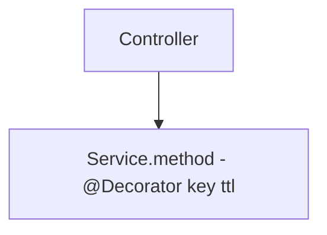
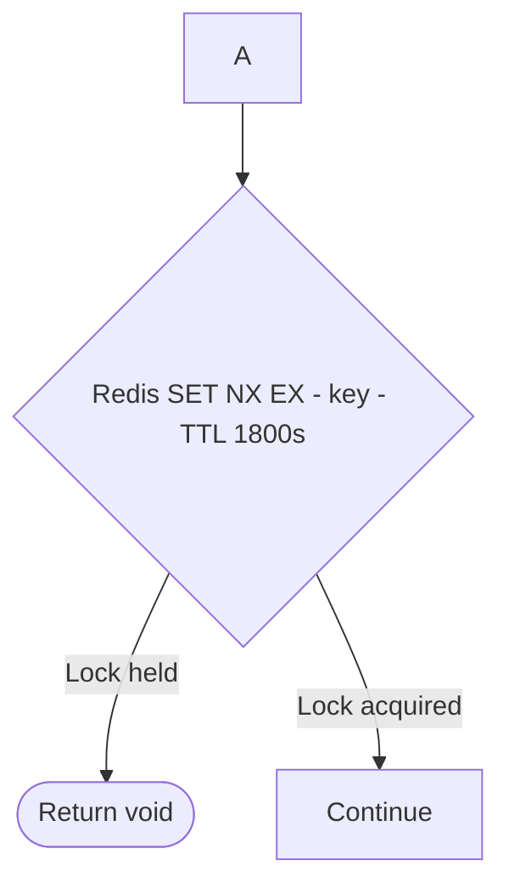
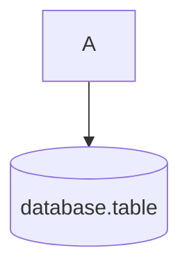
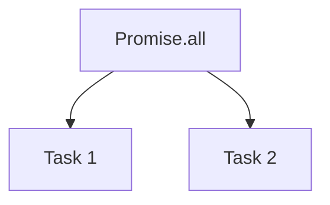
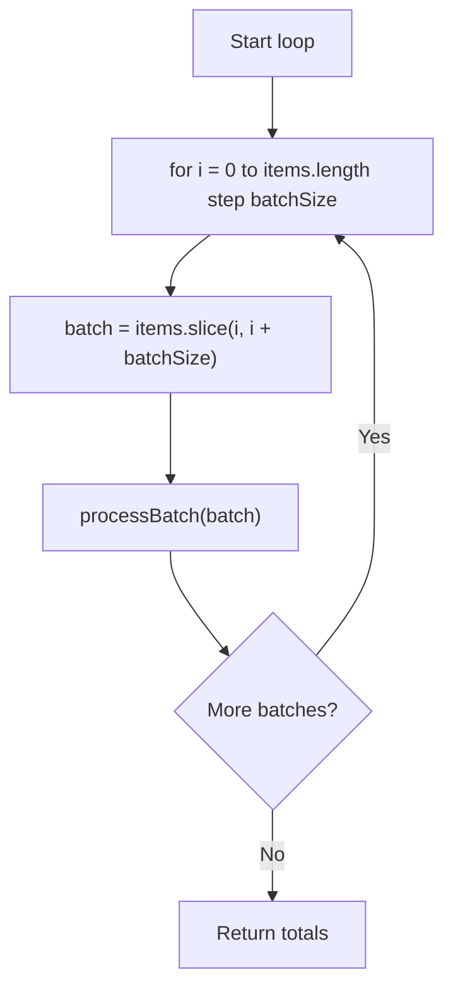

# Mermaid Validator Skill

## MANDATORY WORKFLOW

**Any time you write or edit a Mermaid diagram, you MUST:**

1. Write the diagram
2. Run the validator
3. Fix any errors reported
4. Re-run until clean

**Never** mark a documentation task complete if the validator reports errors.

---

## Validator Script Setup (Per Project)

This skill expects a zero-dependency Node.js validator script at `scripts/validate-mermaid.mjs` in the project root.

If the script doesn't exist yet, create it — see the reference implementation in any project that has already set this up, or ask to scaffold it.

```bash
# Validate all markdown files (default: scans .agents/ directory)
node scripts/validate-mermaid.mjs

# Validate a specific file
node scripts/validate-mermaid.mjs path/to/file.md

# Validate a whole directory
node scripts/validate-mermaid.mjs path/to/dir/
```

**Expected clean output:**
```
Scanned 12 file(s), 3 mermaid block(s).
✅ All diagrams passed.
```

**Error output example:**
```
❌ path/to/file.md
   Line 47 [no-literal-newline]: Literal \n inside node/edge label — use <br/> or rewrite as plain text
   > B --> C[ServiceName.method\n@Decorator]
```

---

## Mermaid Syntax Rules (Mandatory Reference)

### ✅ Safe — No quoting needed
```
Letters, digits, spaces, hyphens, underscores, colons, slashes, dots, angle brackets
```

### ⚠️ Requires `"double quotes"` around the whole label
| Character | Wrong | Right |
|-----------|-------|-------|
| Parentheses `()` | `A[label (detail)]` | `A["label (detail)"]` |
| Percent `%` | `A[100%]` | `A["100%"]` |
| Ampersand `&` | `A[foo & bar]` | `A["foo & bar"]` |
| Hash `#` | `A[#tag]` | `A["#tag"]` |
| At-sign `@` | `A[@lock]` | `A["@lock"]` |

### ❌ Never use inside a diagram block
| Pattern | Wrong | Fix |
|---------|-------|-----|
| Literal `\n` in label | `A[Line1\nLine2]` | `A["Line1<br/>Line2"]` or just `A[Line1 Line2]` |
| HTML entities | `A[foo &amp; bar]` | `A["foo & bar"]` |
| HTML numeric entities | `A[&#40;parens&#41;]` | `A["(parens)"]` |
| Reserved word `end` as node ID | `end[task]` | `End[task]` |

### Edge label quoting
```
A -- simple text --> B          ✅ fine
A -- "text with (parens)" --> B ✅ quoted
A -- text with (parens) --> B   ❌ breaks
```

### Node shape reference
```
A[Rectangle]
A(Rounded)
A([Stadium])        ← OK to have ( inside [ here — this is shape syntax
A{Diamond}
A[(Cylinder/DB)]
A((Circle))
A>Asymmetric]
```

### Mermaid entity codes (inside `"quoted"` labels only)
```
#40; = (    #41; = )    #35; = #    #37; = %
```

---

## Writing a Mermaid Diagram — Checklist

Before saving any diagram, mentally check each line:

- [ ] No `\n` inside any label (bracket, brace, or paren)
- [ ] No `&#NN;` or `&amp;` HTML entities
- [ ] Any label containing `()` is wrapped in `"double quotes"`
- [ ] Node IDs are alphanumeric + underscore only (no hyphens in ID itself)
- [ ] No node ID named `end` (lowercase)
- [ ] Edge labels containing special chars are `"quoted"`
- [ ] Diagram has at least one node and one valid statement

Then run the validator. If it passes, you're done.

---

## Common Diagram Patterns

### Service method with decorator

Note: `@` is safe after the first non-@ character. Put the whole label in quotes to be safe.

### Lock/cache decision


### DB node (cylinder)


### Parallel execution


### Sequential batch loop

